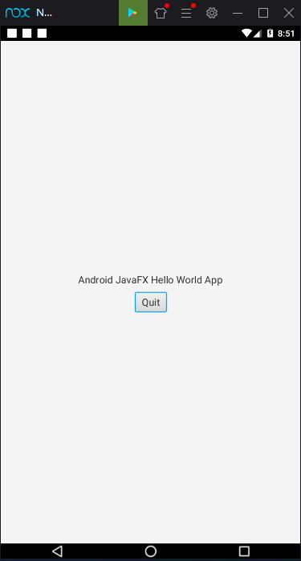

# android-javafx-helloworld
Simple hello world program for android. Using JavaFx, jfxmobile-plugin without gloun.

| Android App (Nox Player)                                     | Desktop App (Windows 10)                                     |
| ------------------------------------------------------------ | ------------------------------------------------------------ |
|  |  |

